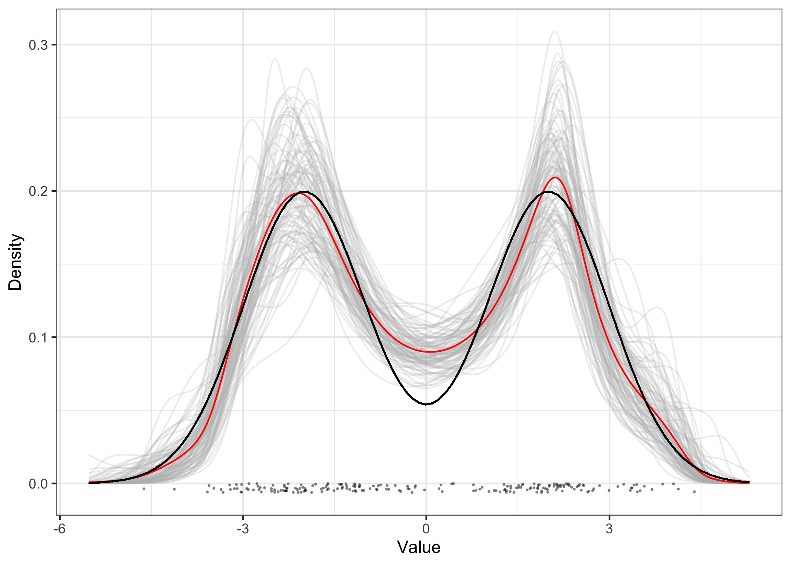

<!-- README.md is generated from README.Rmd. Please edit that file -->

# CopRe Tools for Nonparametric Martingale Posterior Sampling

<!-- badges: start -->
<!-- badges: end -->

A set of tools for Bayesian nonparametric density estimation using
Martingale posterior distributions and including the **Cop**ula
**Re**sampling (CopRe) algorithm. Also included are a Gibbs sampler for
the marginal **M**ixture of **D**irichlet **P**rocess (MDP) model and an
extension to include full uncertainty quantification via a new Polya
completion algorithm for the MDP. The CopRe and Polya samplers generate
random nonparametric distributions as output, leading to complete
nonparametric inference on posterior summaries. Routines for calculating
arbitrary functionals from the sampled distributions are included as
well as an important algorithm for finding the number and location of
modes, which can then be used to estimate the clusters in the data
using, for example, k-means.

## Installation

You can install the development version of CopRe from
[GitHub](https://github.com/blakemoya/copre) with:

``` r
# install.packages("devtools")
devtools::install_github("blakemoya/copre")
```

## Usage

The basic usage of CopRe for density estimation is to supply a data
vector, a number of forward simulations per sample, and a number of
samples to draw:

``` r
library(copre)
data <- c(rnorm(100, mean = -2), rnorm(100, mean = 2))
res_cop <- copre(data, 100, 100)
plot(res_cop) +
  ggplot2::geom_function(
    fun = function(x) (dnorm(x, mean = -2) + dnorm(x, mean = 2)) / 2
    )
```


