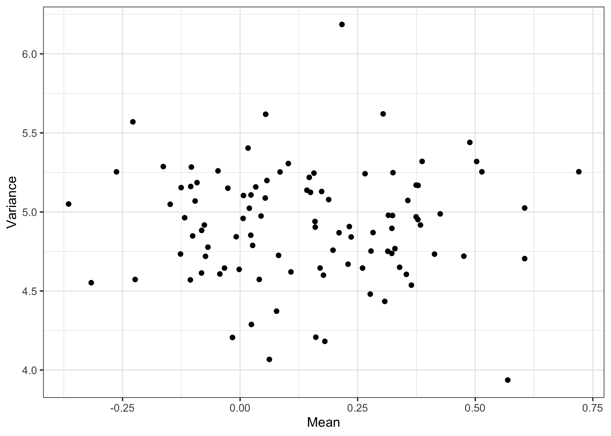
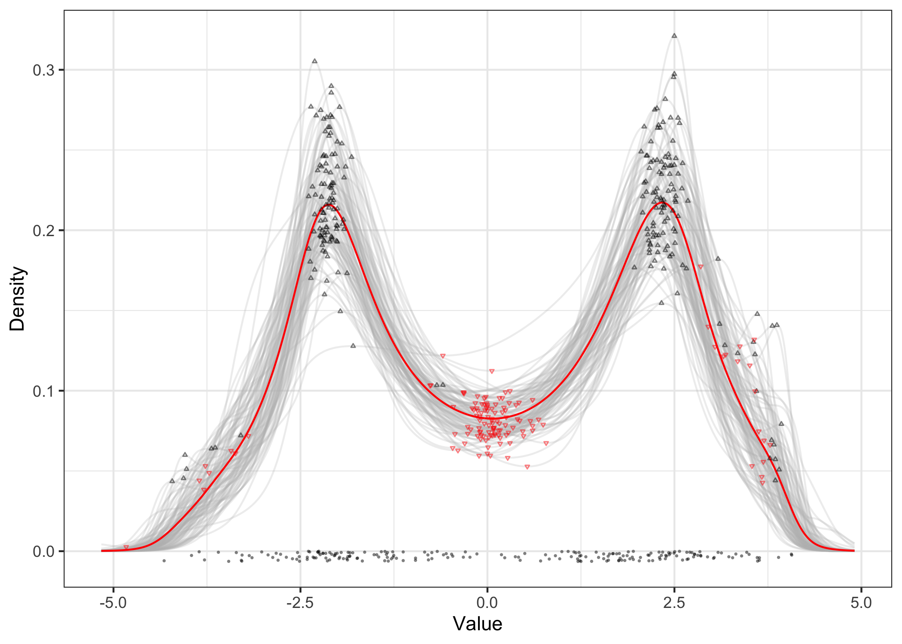

<!-- README.md is generated from README.Rmd. Please edit that file -->

# CopRe Tools for Nonparametric Martingale Posterior Sampling

<!-- badges: start -->

[](https://cran.r-project.org/package=copre)
[](https://github.com/blakemoya/copre)
[](https://github.com/blakemoya/copre/actions)
<!-- badges: end -->

A set of tools for Bayesian nonparametric density estimation using
Martingale posterior distributions including the **Cop**ula
**Re**sampling (CopRe) algorithm. Also included are a Gibbs sampler for
the marginal Gibbs-type mixture model and an extension to include full
uncertainty quantification via a predictive **Seq**uence **Re**sampling
(SeqRe) algorithm. The CopRe and SeqRe samplers generate random
nonparametric distributions as output, leading to complete nonparametric
inference on posterior summaries. Routines for calculating arbitrary
functionals from the sampled distributions are included as well as an
important algorithm for finding the number and location of modes, which
can then be used to estimate the clusters in the data.

## Installation

You can install the latest stable development version of CopRe from
[GitHub](https://github.com/blakemoya/copre) with:

``` r
# install.packages("devtools")
devtools::install_github("blakemoya/copre")
```

## Usage

### CopRe

The basic usage of CopRe for density estimation is to supply a data
vector, a number of forward simulations per sample, and a number of
samples to draw:

``` r
library(copre)
data <- sample(c(rnorm(100, mean = -2), rnorm(100, mean = 2)))
res_cop <- copre(data, 250, 100)
plot(res_cop) +
  geom_function(
    fun = function(x) (dnorm(x, mean = -2) + dnorm(x, mean = 2)) / 2
    )
```

<p align="center">

</p>

Currently only a Gaussian kernel copula is supported but more options
are to be added in future versions.

### SeqRe

Using SeqRe first involves specifying a model via a base measure `G` and
an exchangeable sequence measure `Sq`. Here we can set up a normal
location scale mixture with components assigned according to a Dirichlet
process.

We can then fit the marginal mixture model with the `gibbsmix` MCMC
routine and then extend the results to their full nonparametric
potential via `seqre`.

``` r
b_norm <- G_normls()
s_dp <- Sq_dirichlet()

res_seq <- gibbsmix(data, 100, b_norm, s_dp) |> seqre()
plot(res_seq) +
  geom_function(
    fun = function(x) (dnorm(x, mean = -2) + dnorm(x, mean = 2)) / 2
    )
```

<p align="center">

</p>

### Utilities

The moments of the estimated distributions can be obtained by calling
`moment`, and arbitrary functionals of interest can be obtained
similarly with `functionals`.

``` r
moms <- data.frame(Mean = moment(res_cop, 1),
                   Variance = moment(res_cop, 2))
with(moms,
     qplot(Mean, Variance) +
       theme_bw()
     )
```

<p align="center">

</p>

The function `modes` can be used to isolate local maxima and minima in
the denisty estimates. Here we can see the detected modes in black and
the antimodes in red. Experiment with using sample antimodes as a
distribution over cluster boundaries!

<p align="center">

``` r
res_cop.dens <- grideval(res_cop)
ns <- modes(res_cop.dens, idx = TRUE)
us <- antimodes(res_cop.dens, idx = TRUE)
p <- plot(res_cop.dens)
for (i in 1:length(res_cop)) {
  p <- p + 
    geom_point(data = data.frame(x = ns[[i]]$value,
                                 y = res_cop.dens[i, ns[[i]]$idx]),
               aes(x = x, y = y), shape = 24, size = 0.5, alpha = 0.5) +
    geom_point(data = data.frame(x = us[[i]]$value,
                                 y = res_cop.dens[i, us[[i]]$idx]),
               aes(x = x, y = y), shape = 25, size = 0.5, alpha = 0.5,
               color = 'red')
}
print(p)
```

</p>
<p align="center">

</p>

## Feedback

If you have encounter any bugs or other problems while using CopRe, let
me know using the Issues tab. For new feature requests, contact me via
email at
[blakemoya@utexas.edu](mailto:blakemoya@utexas.edu?subject=%5BGitHub:%20CopRe%5D%20Feature%20Request).
